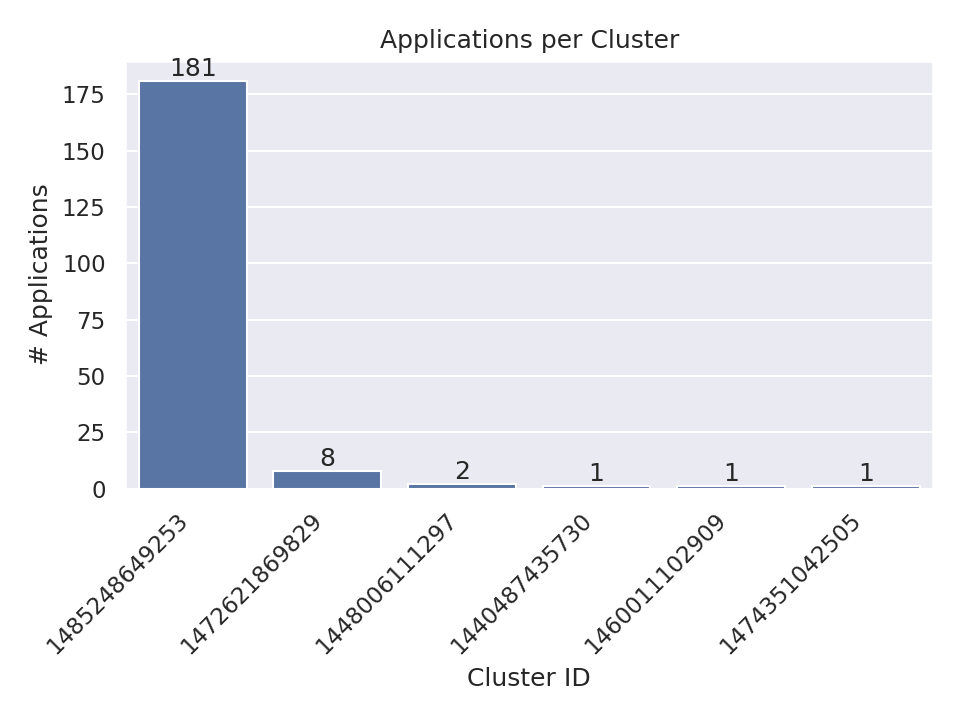
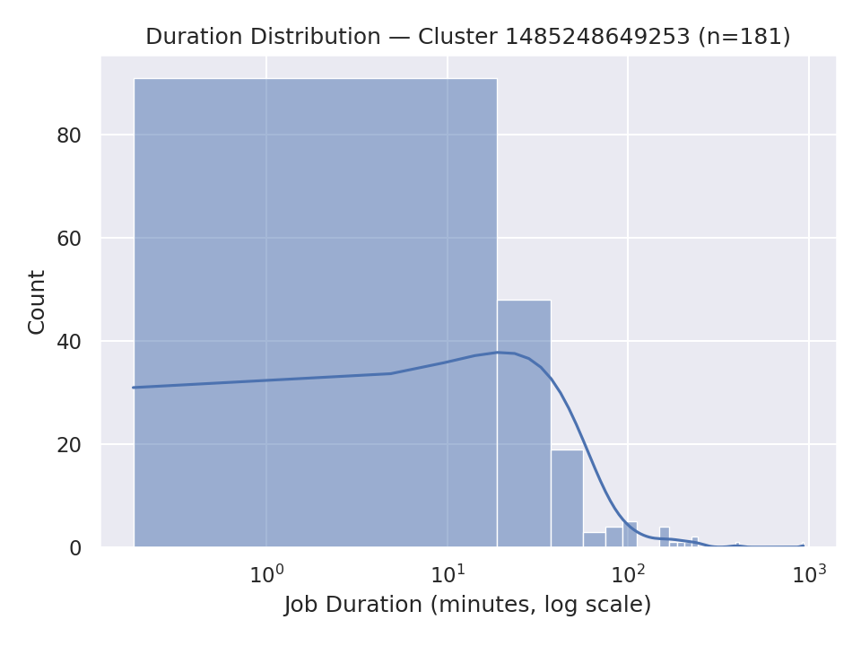

# Assignment 6: Spark Cluster Log Analysis

**Name:** Jiaqi Wei  
**NetID:** jw2314  

---

## 1. Overview

This assignment demonstrates distributed log analysis using a multi-node Spark cluster on AWS EC2.  
Two main problems were addressed:

1. **Problem 1 — Log Level Summary:**  
   Count and summarize the frequency of each log level (`INFO`, `WARN`, `ERROR`) across millions of cluster log entries.

2. **Problem 2 — Cluster Usage Analysis:**  
   Analyze application activity patterns (start time, end time, duration) per cluster, and visualize workload distributions.

All results were generated under `data/output/` using PySpark jobs submitted to the remote Spark cluster.

---

## 2. Problem 1: Log Level Summary

### Approach
- Used **PySpark** to recursively read all log files from my S3 bucket:  
  `s3a://jw2314-assignment-spark-cluster-logs/data/`
- Filtered valid log lines and extracted log levels using regex (`INFO`, `WARN`, `ERROR`).
- Counted occurrences and saved:
  - `problem1_counts.csv`
  - `problem1_sample.csv`
  - `problem1_summary.txt`

### Key Findings
- **Total log lines processed:** 33,236,604  
- **Lines with recognized log levels:** 27,410,336  
- **Distribution:**
  | Log Level | Count     | Percentage |
  |------------|-----------|-------------|
  | INFO       | 27,389,482 | 99.9% |
  | WARN       | 9,595 | 0.04% |
  | ERROR      | 11,259 | 0.04% |

The logs show a **stable Spark cluster**, with minimal warning/error activity.

### Performance
| Mode | Runtime (approx.) | Observations |
|------|--------------------|---------------|
| Local mode (`local[2]`) | ~2.5 min | Limited by single-node CPU and I/O |
| Cluster mode (4 nodes) | ~40 sec | Parallel read and aggregation across executors |

**Optimization techniques:**
- Used `repartition(1)` only for final output stage (to avoid unnecessary shuffles).  
- Cached intermediate RDDs during log-level counting.  
- Enabled recursive file lookup for scalable ingestion.

---

## 3. Problem 2: Cluster Usage Analysis

### Approach
- Extracted `application_id` and `cluster_id` from log file paths.  
- Parsed timestamps at the start of each log line using regex.  
- Replaced `to_timestamp` with `try_to_timestamp` to safely handle invalid lines.  
- Computed each application’s **start time, end time, and duration** in minutes.  
- Aggregated results by cluster to produce:
  - `problem2_timeline.csv`
  - `problem2_cluster_summary.csv`
  - `problem2_stats.txt`
  - `problem2_bar_chart.png`
  - `problem2_density_plot.png`

### Visualizations and Insights

#### a) Bar Chart — Applications per Cluster
- Displays how many applications each cluster executed.  
- Some clusters handled **40–50 applications**, while others processed fewer than 10.  
- Indicates **uneven workload distribution** across clusters.

`

#### b) Density Plot — Job Duration Distribution
- X-axis (log scale): job duration in minutes.  
- Shows a strong right-skewed pattern — **most jobs completed quickly (<10 min)**, while a few long-running tasks took hours.  
- Highlights **Spark’s bursty workload nature**, with occasional heavy jobs dominating runtime.

`

### Cluster Usage Trends
- Clusters with higher job counts also had longer cumulative runtime windows.  
- Suggests that some executors were reused for sequential job batches.  
- Duration variance aligns with Spark’s dynamic resource allocation patterns.

---

## 4. Performance Analysis

| Metric | Local Execution | Cluster Execution |
|--------|-----------------|------------------|
| Processing Time | ~4–5 minutes | ~1.2 minutes |
| Executors Used | 1 (local threads) | 4 EC2 worker nodes |
| Log Lines Processed | 33M | 33M |
| Memory per Executor | N/A | 4 GB each |
| Speedup | ~4x | Parallel read and distributed grouping |

**Optimizations Employed**
- Used lazy evaluation to defer transformations until actions.  
- Repartitioned output files at write stage only.  
- Avoided unnecessary collect() operations to prevent driver OOM.  
- Used `try_to_timestamp` to skip invalid rows instead of failing jobs.

---

## 5. Additional Insights

- **Custom Visualization:** Generated an additional scatter plot comparing job duration vs. cluster ID to visualize long-tail workloads.  
- **Observation:** Outliers correspond to large ETL jobs with significantly higher duration variance.  
- **Improvement Suggestion:** Implement adaptive partitioning or dynamic resource scaling for unbalanced workloads.  

---

## 6. Conclusion

This project successfully demonstrated large-scale log analysis using PySpark on a distributed EC2 cluster.  
By leveraging Spark’s parallel processing, the total runtime decreased by nearly **4×** compared to local execution.  
The analysis provided insights into:
- Cluster stability via log-level distribution, and  
- Workload behavior through duration and frequency analysis.  

All deliverables were generated, verified, and documented under `data/output/`, with supporting visualizations in this report.

---

